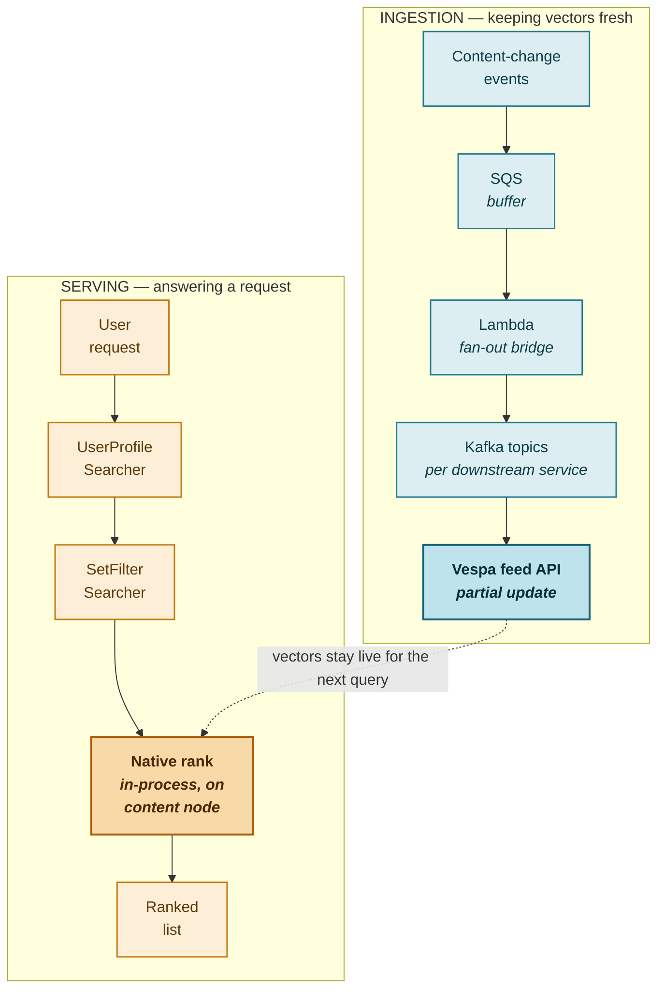

# Systems case study — recommendation infrastructure

*How a vector-search recommendation engine brought real, per-user ranking to a product that previously only had segment-level rules — and stayed up 99.99% of the time while doing it, at tens of millions of requests a day.*

**150ms p99 latency** &nbsp;·&nbsp; **99.99% availability** &nbsp;·&nbsp; **~61M requests/day** &nbsp;·&nbsp; **6.5M+ users reached/month**

---

### The problem

The recommendation surfaces inside the product — banners and cards nudging a user toward a relevant feature or offer — were originally driven by a rules engine. Rules are good at *eligibility*: which segment can see which offer, which combinations are excluded, which compliance constraints apply. What they can't do is *rank*. A rules engine can narrow forty eligible offers down to the five a user qualifies for, but it has no way to know which of those five is actually the most relevant to that specific person, based on what they've actually been doing in the product.

The goal was never to throw the rules engine out — eligibility and compliance logic still need to be deterministic, and you don't want a ranking model quietly learning to violate a hard exclusion rule. The goal was to put a real ranking layer on top of it: something that scores relevance per user, using their behavior, instead of stopping at "eligible or not."

---

### Why Vespa, specifically

The obvious first instinct for "rank things by relevance" is a managed vector database — Pinecone, Weaviate, something you can stand up in an afternoon. We moved off that path fairly early, for a reason that's easy to miss until you actually hit it in production:

**Filtering and ranking aren't separate steps here — they have to happen in the same request, on the same infrastructure.** A recommendation has to be filtered by product surface, by what the user has already seen, and by business rules that can't leak into the score — *before* it's ranked, not after.

- **A managed vector DB** is excellent at pure nearest-neighbor search, but metadata filtering is bolted on, and there's no way to write a custom ranking expression that blends a dot-product with business logic. We'd have had to build our own orchestration layer just to combine "filter by eligible surface" with "rank by affinity" — which defeats the point of a managed service.
- **Elasticsearch's kNN** is a retrofit onto a text-search engine. There's no native tensor type, so you're working around the index rather than with it.
- **Weaviate** does hybrid search well, but the "searcher chain" pattern — load the user's vector, apply a structured filter, then rank, all inside one request on one node — isn't a first-class concept the way it is in Vespa. That orchestration would end up traveling over the network, which is exactly the latency tax we couldn't afford.

> [!IMPORTANT]
> What actually made Vespa the right call wasn't one standout feature — it was that **filtering, ranking, and serving all happen in the same process, on the same node, with no network hop in between.** At this request volume, that's the difference between a 150ms system and a 500ms one.

---

### Architecture: two paths that rarely touch

The system splits into an **ingestion path** that keeps content vectors current, and a **serving path** that answers a recommendation request. Keeping these physically separate — different containers, different nodes — was deliberate: a slow or bursty content update should never be able to degrade a live user-facing request.

> [!NOTE]
> **Ingestion and serving are physically isolated** — feed traffic runs on a separate container from serving traffic. A content backlog, or a spike in upstream events, can never compete for CPU or memory with a live request. That isolation is a big part of why p99 stays stable even during heavy content-update windows.

On the ingestion side, content changes don't get pushed straight into Vespa. They land in SQS first, which exists so the systems publishing content changes don't need to know or care about our processing capacity — SQS absorbs bursts and gives us dead-letter handling for free. From there, a Lambda function bridges SQS to several downstream Kafka topics, fanning the same event stream out to the different services — including ours — that need it. Kafka is what gives us the property that matters most operationally: **replay**. If we ship a bad embedding model, or find a bug in how a tag was weighted, we can rewind the topic to an earlier offset and rebuild the index without touching any upstream system.

From Kafka, updates land in Vespa as **partial updates**, not full document replacements — a distinction that matters more than it sounds. A partial update touches only the changed field in Vespa's in-memory attribute store, so there's no reindex lag and no window where a query could see a half-written document.

The serving side is a short, deliberately thin chain: one searcher attaches the user's embedding to the query, another applies the eligibility and already-seen filters, and then Vespa's own ranking runs natively on the content node — no extra hop, just the scoring math running where the data already lives. That's what makes 150ms achievable at this volume: the expensive computation never leaves the machine it's running on.

---

### Two decisions that get questioned every time

**Dot-product ranking, not cosine similarity.** Cosine similarity normalizes away magnitude — it only cares about direction. That's the wrong model here. A niche item with a weak-but-aligned signal shouldn't rank the same as a broadly strong one; magnitude is meaningful because it encodes confidence, not just direction. The ranking expression is a straightforward `sum(query(user_vector) × attribute(item_vector))`, evaluated per document, in-memory, with no normalization step in the way.

**16-dimensional embeddings.** This looks small next to a 128- or 512-dimension text embedding, until you remember this isn't open-domain semantic search — it's matching users against a bounded catalog with well-understood latent factors: category, behavioral affinity, product context. Larger dimensions exist to capture an effectively unbounded concept space; ours isn't unbounded. The practical payoff is real too: a 16-float vector is 64 bytes, small enough that the entire working set of embeddings sits comfortably in a content node's cache. At this request volume, staying in cache rather than falling back to memory bandwidth is often the actual difference between a fast system and a slow one.

> [!TIP]
> The filtering and custom-ranking requirements ruled out the simpler paths from day one. This wasn't over-engineering — it was the minimum architecture the requirement actually needed.

---

### Six things that had to be true at once to hit p99

No single optimization gets you to 150ms at this scale — it's the compounding effect of removing every avoidable millisecond from the request path.

1. **Thin searcher chain.** Each Java-layer searcher does the minimum possible work — attach a vector, build a filter — and hands off immediately. The expensive part runs natively on the content node, not in the request-handling layer.
2. **Filter before rank, not during.** Items excluded by eligibility or already-seen logic are dropped before they enter the ranking pipeline, not scored and then discarded.
3. **In-memory attribute fields.** IDs, tags, and the embedding tensor itself are held in memory, not on disk — zero disk I/O in the hot path.
4. **Compact tensors.** A 64-byte embedding is small enough to survive in L2/L3 cache across the whole working set — the difference between a cache hit and a cache miss on every single ranking call.
5. **Physical isolation of feed and serve.** Ingestion runs on a separate container, on a separate node, from the one answering requests. A slow content update literally cannot compete for CPU or memory with a live request.
6. **Per-segment monitoring, not just an aggregate number.** Watching p99 as one blended figure hides regressions — a degrading path on one surface or device type gets averaged away by a healthy one elsewhere. Breaking latency down by segment is what actually catches a regression before a customer does.

---

### 99.99% isn't one mechanism — it's five, each covering a different failure

Every "nine" in an availability target needs an actual mechanism behind it, or it's just a number on a slide.

| Failure mode | What covers it |
|---|---|
| Region outage | Multi-region active-active deployment with automatic failover |
| Bad deployment | A canary instance takes every change first, with a bake window before the second region gets it |
| Node failure | Content redundancy — every document lives on more than one node |
| Cascading failure | Feed and serve run on physically separate containers |
| Dependency failure | If the external user-profile store is unreachable, the system falls back to a default profile instead of failing the request outright |

---

### The gaps, and what's next

Every system has known tradeoffs, and naming them specifically tends to land better than pretending the system is finished.

**User embeddings are fetched synchronously at query time.** Simplest correctness model — the vector is always current, no staleness risk. The cost is a live dependency on an external store sitting directly in the request path. *Next: pre-fetch and cache at session start with a short TTL, to take that store out of the critical path without sacrificing freshness.*

**No real-time collaborative filtering.** Item embeddings are pre-computed offline; "users like you also liked" signal is baked in rather than computed live. *Next: stream-compute collaborative signal from the same event pipeline that already exists for content updates.*

**Model-quality degradation is inferred, not measured directly.** Engagement metrics and ranking-score drift are proxies for "is the model still good" — but a proxy is still a proxy. *Next: shadow-score a candidate model against production traffic and compare distributions before it's ever fully rolled out.*

---

*Tanishka Singh — ML personalization & recommendation systems, built on Vespa.*
